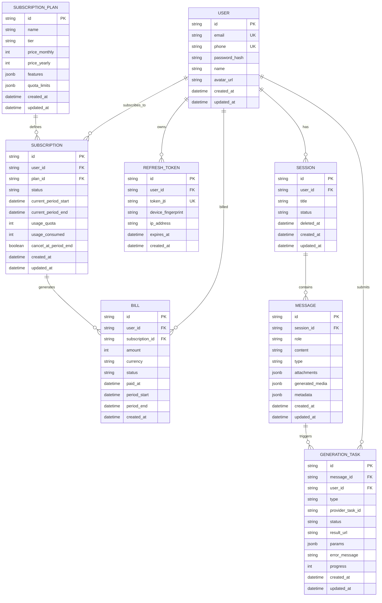

# Database ER Diagram — AI Chat Web MVP

> Generated by Core · 后端工程师  
> Tech stack: PostgreSQL 16 + Prisma  
> Date: 2026-06-02

## 索引设计

| 表 | 索引字段 | 类型 | 用途 |
|---|---|---|---|
| users | email | B-Tree | 登录查询 |
| users | phone | B-Tree | 登录查询 |
| refresh_tokens | user_id | B-Tree | 设备数量统计、批量注销 |
| sessions | user_id + updated_at DESC | B-Tree | 历史列表查询 |
| sessions | deleted_at | B-Tree | 软删除过滤 |
| messages | session_id + created_at ASC | B-Tree | 消息列表分页 |
| generation_tasks | user_id + status | B-Tree | 用户任务列表查询 |
| generation_tasks | message_id | B-Tree | 消息关联查询 |
| generation_tasks | provider_task_id | B-Tree | Webhook 回调查找 |
| subscriptions | user_id + status | B-Tree | 当前订阅查询 |
| bills | user_id + created_at DESC | B-Tree | 账单历史查询 |
