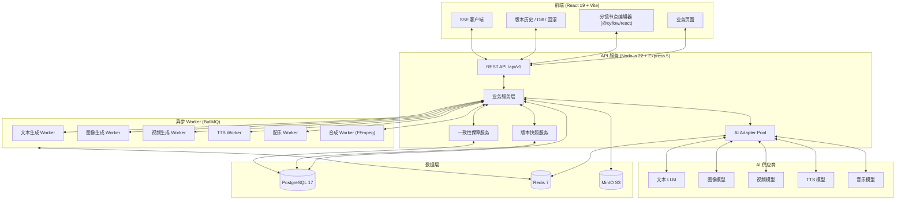
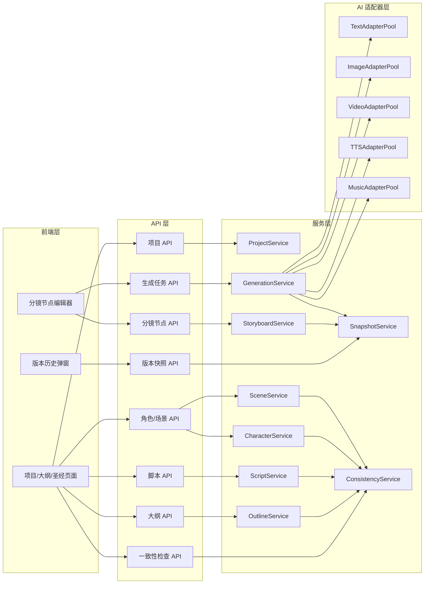
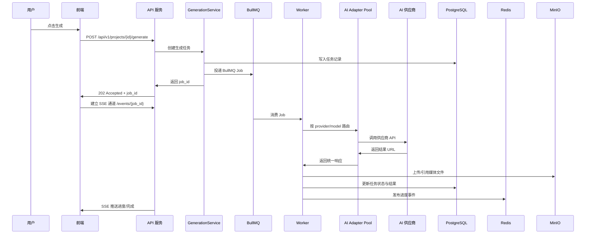
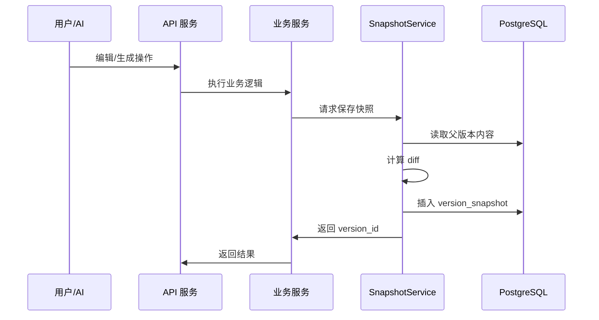
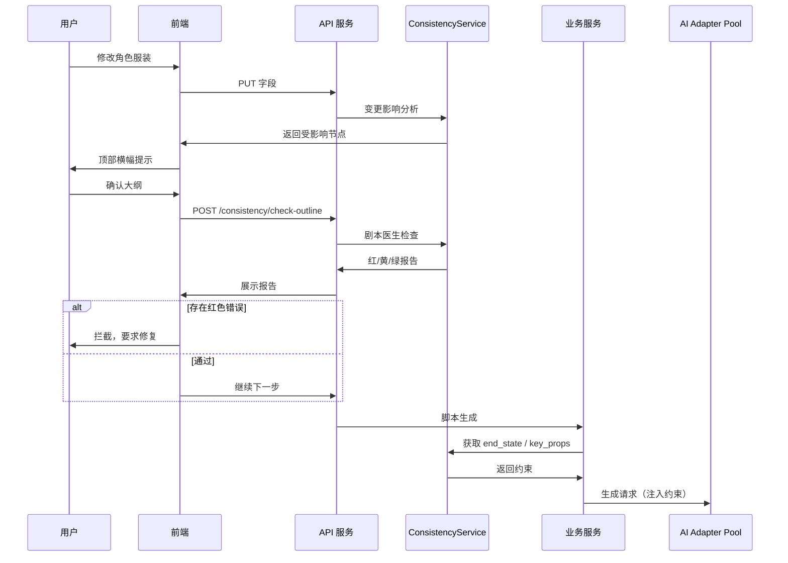
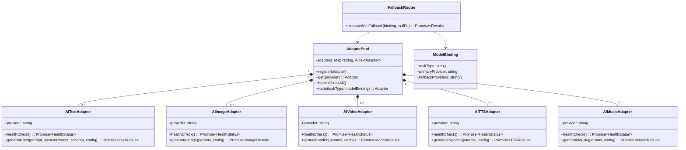
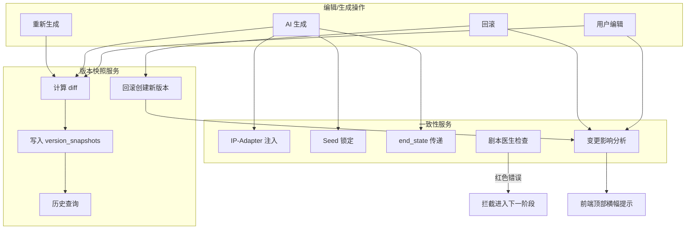
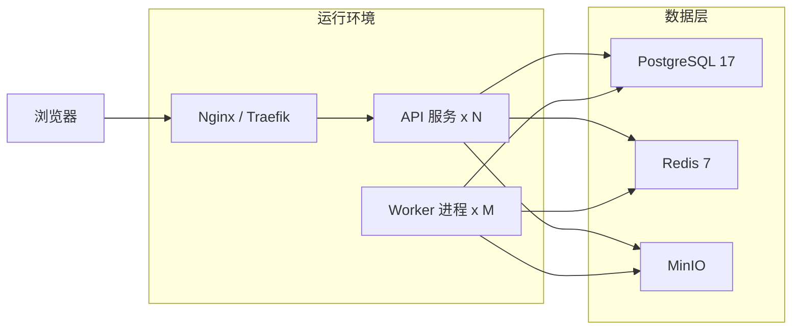

# 极简栈创造 v1.0 系统架构总览

> 状态：已冻结（v1.0）  
> 配套文档：
> - `/docs/architecture/tech-stack.md`
> - `/docs/adr/ADR-001-tech-stack.md`
> - `/docs/adr/ADR-002-adapter-layer.md`
> - `/docs/architecture/performance-baseline.md`

---

## 1. 系统定位

极简栈创造是一个面向内容创作者的 AI 辅助短剧生产平台。用户从创意描述出发，经大纲、角色/场景圣经、单集脚本、分镜节点、分镜图、配音/配乐/视频片段，最终合成完整短剧。

v1.0 采用**单体式分层架构**：

- **Web 前端**（React + Vite）负责创作界面、节点编辑器、版本历史、结果预览。
- **API 服务**（Node.js + Express）承载业务逻辑、版本快照、一致性保障。
- **AI 适配器层**统一封装五类生成任务（文本/图像/视频/TTS/音乐）。
- **异步 Worker**（BullMQ）执行长时 AI 生成任务，通过 SSE 向前端推送进度。
- **数据层**（PostgreSQL + Redis + MinIO）分别持久化结构化数据、缓存/队列状态、生成的媒体资产。

---

## 2. 高层架构图

---

## 3. 模块边界与依赖关系

### 3.1 依赖方向规则

- **前端**只能调用 **API 层**，禁止直接访问数据库、Redis、MinIO。
- **API 层**只能调用 **服务层**，禁止直接调用 Adapter。
- **服务层**可调用 **AI 适配器层**、版本快照服务、一致性服务、数据层。
- **AI 适配器层**只向上暴露统一接口，内部隔离供应商 SDK。
- **Worker**与 API 服务共享服务层代码，但独立进程运行，通过 Redis/BullMQ 接收任务。

---

## 4. 核心数据流

### 4.1 AI 生成请求流

### 4.2 版本快照流

### 4.3 一致性保障流

---

## 5. AI 适配器层详细设计

### 5.1 路由与降级策略

1. **节点级模型选择**：前端在每个生成节点右上角展示当前模型；切换后更新 `ModelBinding`，下次生成生效。
2. **Provider 路由**：`AdapterPool.route(taskType, provider)` 返回对应 Adapter 实例。
3. **降级触发条件**：
   - 触发：网络超时、5xx、rate limit、健康检查失败。
   - 不触发：prompt 违规、内容审核、参数错误。
4. **Fallback 链**：按 `fallbackProviders` 顺序尝试，每次重试间隔指数退避。

---

## 6. 版本快照与一致性模块集成

---

## 7. 部署拓扑（单机/最小集群）

- API 服务与 Worker 可部署在同一容器镜像的不同启动命令中。
- 初始阶段 N=1、M=1 即可满足需求；视频生成任务多时水平扩展 Worker。

---

## 8. 关键接口契约

### 8.1 前端 ↔ API

- 所有 API 以 `/api/v1` 为前缀。
- 认证 Header `Authorization` 当前透传，不做校验（v1.0 单用户）。
- 长任务返回 `202 Accepted`，通过 SSE `/api/v1/events/{job_id}` 推送进度。

### 8.2 API ↔ AI 适配器层

- 统一调用入口：`generate(taskType, params, modelBinding)`。
- 统一响应：`{ data: Result, usage: Usage, latencyMs: number }`。
- 统一错误：`{ code: string, message: string, retryable: boolean }`。

### 8.3 服务层 ↔ 版本快照

- `createSnapshot(entityType, entityId, content, source, aiModel?, promptOverride?)`。
- `compareSnapshots(entityType, entityId, fromVersion, toVersion)` 返回字段级 diff。
- `rollback(entityType, entityId, versionId)` 创建新版本并返回新 content。

---

## 9. 演进路线

- **v1.0（当前）**：单体式分层，SSE 推送，BullMQ 队列，MinIO 存储。
- **v1.1**：引入 OpenTelemetry 监控、Adapter 自动负载均衡、版本快照清理策略。
- **v2.0**：评估微服务拆分（视频合成独立服务）、全局项目快照、跨项目一致性复用。

---

## 10. 变更记录

| 日期 | 版本 | 变更 | 作者 |
|------|------|------|------|
| 2026-06-18 | v1.0 | 初始架构总览 | Blueprint |
